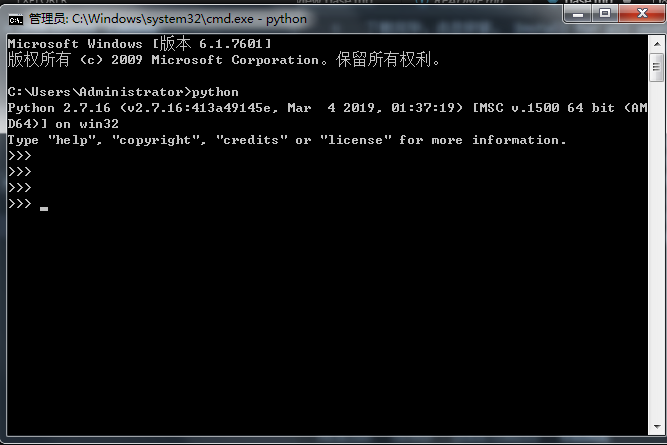
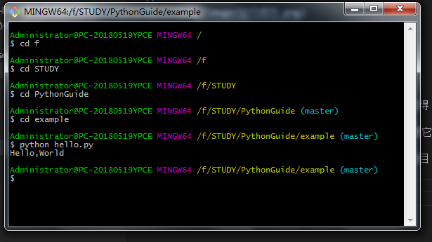

# Python 基础学习

## Python 安装

进入 [Python 官网](www.Python.com)，点击 Downloads- Windows-Python2.7.16,因为我的电脑是Windows,所以下载Windows版本，还有其他的版本，请参照官网。
下载完毕，点击安装， Install for all users ,点击下一步，默认在 C 盘，你可以选择你自己想要存储的磁盘，我是存在 D 盘。
点击完成，安装结束。

## 运行命令提示符
可以从开始菜单点击程序-附件-命令提示符来启动 Python,我们直接输入 Python ,系统提示我们找不到 Python 的命令,这是怎么回事呢, Windows 会根据命令查找 Python ,如果找不到，系统会提示错误,所以我们需要在把Python的路径填写在命令提示符里,打开我的电脑-属性-高级-环境变量-在系统变量选择 Path - 编辑 -在当前系统加Python安装目录，例如：```;D:\soft\python27```



## 运行第一个程序
在终端输入 print "Hello，World"   
系统会出现 Hello，World  
exit（）  
这样是算运行第一个程序  
但是唯一的一个缺点就是我们没有保存下来，下次输入还得重新做。  
我们可以在MarkDown里写下print "Hello，World"再把它命名为 hello.py  
首先我们在git bash.exe找到我们hello.py保存的所在目录，然后我们输入python hello.py  




git add .  
git commit -m '第一个python程序'  
git push  

## 数据类型
* 整型 int：1、2、3...
print 1
* 浮点型 float： 1.00、5.2 print 1.00
* 字符串："abc" print "abc"
* 布尔型。
    * and：2 > 1 and 3 > 2, 一假则假
    * or：2 > 1 or 1 < 2 一真则真
    * not：!true === false, !false === true

## Python定义字符串
字符串可以用""、''来表示
* 如果字符串包含'',那我们可以用“”来表示。例如：
"I'm OK"
* 如果字符串包含""，那我们可以用''来表示。例如：'Learn "Python" in imooc'
* 如果字符串既包括'又包括"，那我们就需要对字符串的某些特殊字符进行“转义”，Python字符串用\进行转义。
Bob said "I'm OK".
'Bob said \"I\'m OK\".'
* 常用的转义字符还有：
\n 表示换行
\t 表示一个制表符
\\ 表示 \ 字符本身
下面运行一个例子:
```python
Python was started in 1989 by "Guido".
Python is free and easy to learn.
```
## Python的注释

Python的注释以 # 开头，后面的文字直到行尾都算注释

     # 这一行全部都是注释...
     print 'hello' # 这也是注释

## Python的变量
在 Python 中，变量的概念基本和初中代数方程变量是一致，例如对于方程式y=x*x,x就是变量。当 x=2时，计算结果是4，当 x=5时，计算结果是25.
* 变量不仅可以是数值，还可以是任意数据类型。
* 变量名必须是大小写英文、数字和下划线（_）的组合，且不能用数字开头。
a=1；变量 a 是一个整数。
t _ 007=' T007 '；t _ 007 是一个字符串。
* 等号=是赋值语句，可以把任意数据类型赋值给变量，同一个变量可以反复赋值，而且可以是不同类型的变量。
```python
a=123  # a 是整数
print a
a='imooc'  # a 变为字符串
print a
```
## Python raw字符串与多行字符串
* 如果一个字符串包含很多需要转义的字符，对每一个字符都进行转义会很麻烦。为了避免这种情况，我们可以在字符串前面加个前缀 r ，例如 r '...'
* 但是 r '...' 表示法不能表示多行字符串，也不能表示包含 ' 和 " 的字符串.
如果要表示多行字符串，可以用 '''...''' 表示：
```python
'''Line 1
Line 2
Line 3'''
```
上面这个字符串的表示方法和下面的是完全一样的：
```
'Line 1\nLine 2\nLine 3'
```
* 还可以在多行字符串前面添加 r ，把这个多行字符串也变成一个raw字符串：
```python
r'''Python is created by "Guido".
It is free and easy to learn.
Let's start learn Python in imooc!'''
```
## Python中Unicode字符串
* 计算机只能处理数字，如果要处理文本，就必须先把文本转换为数字才能处理。
* Python在后来添加了对Unicode的支持，以Unicode表示的字符串用u'...'表示，比如：
print u'中文'
中文
注意: 不加 u ，中文就不能正常显示。
* Unicode字符串除了多了一个 u 之外，与普通字符串没啥区别，转义字符和多行表示法仍然有效：
转义：
u'中文\n日文\n韩文'
多行：
u'''第一行
第二行'''
* raw+多行：
ur'''Python的Unicode字符串支持"中文",
"日文",
"韩文"等多种语言'''
如果中文字符串在Python环境下遇到 UnicodeDecodeError，这是因为.py文件保存的格式有问题。可以在第一行添加注释
```python
      # -*- coding: utf-8 -*-
```
目的是告诉Python解释器，用UTF-8编码读取源代码。然后用Notepad++ 另存为... 并选择UTF-8格式保存。

## Python中整数和浮点数
基本运算：Python支持对整数和浮点进行四则运算，运算规则和数学上四则运算完全一致。
基本运算：
```python
* 1+2+3 #==>6
* 4*5-6 #==>14
* 7.5/8+2.1    # ==> 3.03375
```
使用括号可以提升优先级：
```python
(1+2)*3    # ==>9
```
Python整数运算结果仍然是整数，浮点数运算结果仍然是浮点数：
```python
1+2  # ==>3 整数 3
1.0 + 2.0 # ==> 浮点数 3.0
```
```python
1+2.0 # ==> 浮点数 3.0
```
整数和浮点数混合运算的结果就变成浮点数。

### 区分整数和浮点数

* 整数运算的结果永远是精确的，浮点数运算的结果不一定精确，因为计算机无法精确出无限循环小数，比如0.1换成二进制表示就是无限循环小数。
```python
11/4 #==>2
```
* 发现Python的整数除法，即使除不尽，结果仍然是整数，余数直接被扔掉。不过Python提供了一个求余的运算% 可以计算余数：
```python
11 % 4 # ==> 3
```
* 想要计算11/4的精确结果，按照“整数和浮点数混合运算的结果是浮点数”的法则，把两个数中一个变成浮点数再运算就没问题。
```python
11.0 / 4 # ==> 2.75
```
## Pythond的布尔运算

了解 Python 的布尔运算，只有 True 和 False 两种值，但是布尔运算有以下几种运算：
* 与运算：只有两个布尔值都为True,计算结果才为True.
```python
True and True    # = =>True
True and False   # = =>False
False and True   # = =>False
False and False  # = =>False  一假则假
```
* 或运算：只要有一个布尔值为 True ，计算结果就是True.
```python
True or True    # = =>True
True or False   # = =>True
False or True   # = =>True
False or False  # = =>False
```
* 非运算：把 True 变为 False，或者把 False 变为True.
```python
not True   # = =>False
not False  # = =>True
```
布尔运算在计算机用来做条件判断，根据计算结果为 True 或者 False，计算机可以自动执行不同的后续代码。

在 Python 中，布尔类型还可以与其他数据类型做 and、or和 not 运算，请看下面的代码：
```python
> a = True
print a and 'a=T' or 'a=F'
# a=T
```
计算结果不是布尔类型，而是字符串 'a=T'，这是为什么呢？

> 因为 Python 把0、空字符串''和 None 看成 False，其他数值和非空字符串都看成 True，所以：
True and 'a=T' 计算结果是 'a=T'
继续计算 'a=T' or 'a=F' 计算结果还是 'a=T'

其中又涉及到 and 和 or 运算的一条重要法则：短路计算。

1. 在计算 a and b 时，如果 a 是 False，则根据与运算法则，整个结果必定为 False，因此返回 a；如果 a 是 True，则整个计算结果必定取决与 b，因此返回 b。

2. 在计算 a or b 时，如果 a 是 True，则根据或运算法则，整个计算结果必定为 True，因此返回 a；如果 a 是 False，则整个计算结果必定取决于 b，因此返回 b。

## Python创建list
Python 内置的一种数据类型是列表：list，list是一种有序的数据集合，可以随时添加和删除其中的元素。
比如：列出班里所有同学的名字，就可以用一个List来表示：

```python
print ['Michael', 'Bob', 'Tracy'] # ['Michael', 'Bob', 'Tracy']
```
构建list十分简单，直接用"[]"把list所有元素都扩起来，就是一个list的对象，通常我们把list赋值给一个变量，
```python
L = ['Adam', 95.5, 'Lisa', 85, 'Bart', 59]
print L
# ['Adam', 95.5, 'Lisa', 85, 'Bart', 59]
```

可以理解为等号左边为L，是变量，等号右边为变量的值。
* 由于Python是动态语言，所以list中包含的元素并不要求都必须是同一种数据类型，我们完全可以在list中包含各种数据：
```python
>>> L = ['Michael', 100, True]
```
一个元素也没有的list，就是空list：
```python
>>> empty_list = []
```

## Python按照索引访问list
由于list是一个有序组合，可以用List按照分数从高到低表示班里的三个同学：
```python
L=['Adam','Lisa','Bart']
```
那我们如何从list获取指定的第N名同学，可以通过索引来获取list中的指定元素。

**需要特别注意的是，索引从0开始，也就是说，第一个元素的索引是0，第二个元素的索引是1，以此类推。**

因此，要打印第一个同学的名字用L[0]:
```python
>>>print L[0]
Adam
```
要打印第二个同学的名字用L[1]:
```python
>>>print L[1]
Lisa
```
要打印第三个同学的名字用L[2]:
```python
>>>print L[2]
Bart
```
要打印第四个同学的名字用L[3]:
```python
>>>print L[3]
Traceback (most recent call last):
  File "index.py", line 5, in print L[3]
IndexError: list index out of range
```
报错了！IndexError意思就是索引超出了范围，因为上面的list只有3个元素，有效的索引是 0，1，2。

**所以，使用索引时，千万注意不要越界。**

Python之倒序访问list
还用list按分数从高到低表示出班里的三个同学：
```python
L=['Adam','Lisa','Bart']
```
这时，老师说，请分数最低的同学站出来，
要写代码完成这个任务，我们可以先数一数这个 list，发现它包含3个元素，因此，最后一个元素的索引是2：
```python
print L[2]
Bart
```
用另外一种方法：Bart同学是最后一名，俗称倒数第一，所以，我们可以用 -1 这个索引来表示最后一个元素：
```python
print L[-1]
Bart
```
类似的，倒数第二用 -2 表示，倒数第三用 -3 表示，倒数第四用 -4 表示：
```python
print L[-2]
Lisa
print L[-3]
Adam
print L[-4]
Traceback (most recent call last):
  File "index.py", line 5, in 
    print L[-4]
IndexError: list index out of range
59
85
95.5
L[-4] 报错了，因为倒数第四不存在，一共只有3个元素。
```

**使用倒序索引时，也要注意不要越界。**

#Python之添加新元素
现在，班里有3名同学：
```python
L=['Adam','Lisa','Bart']
```
今天，班里转来一名新同学Paul，如何把新同学添加到其中？
第一个办法是用list的 **append( )** 方法，把新同学加到末尾：
```python
L=['Adam','Lisa','Bart']
L.append('Paul')
print L
['Adam','Lisa','Bart','Paul']
```
append()总是把新的元素添加到list的尾部。
如果Paul同学表示自己总是考满分，是第一名，这时候该怎么办？
方法是用list的 **insert（）**方法，它接受两个参数，第一个是索引号，第二个参数是待添加的新元素：
```python
L=['Adam','Lisa','Bart']
L.insert(0,'Paul')
print L
['Paul','Adam','Lisa','Bart']
L.insert(0,'Paul')的意思是，'Paul'将被添加到索引上（也就是第一个），而原来索引为0的Adam同学上的所有同学，自动向后移动一位。


